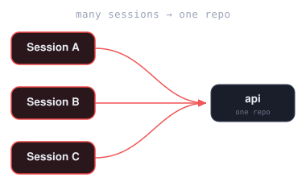
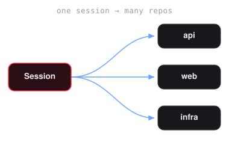
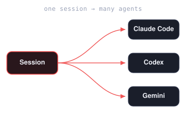

#  Klaussy

**Run multiple repos. Mix any agents. In one window.**
The multi-agent workspace for professional engineers.

[](https://github.com/steph-dove/klaussy-desktop/stargazers)

*Created by an ex-GitHub, Microsoft & Twitch engineer. Trusted by engineers at Microsoft, Meta, GitHub, Twitch, Rad AI, and O'Reilly Media.*

A desktop app for **macOS, Windows, and Linux**. Run multi-repo coding sessions with any mix of AI agents (**Claude, Gemini, Copilot, Codex, Cursor, Cline**) side-by-side. Review pull and merge requests with AI across **GitHub, GitLab, and Bitbucket**, and get blazing-fast, 100% local autocomplete that never leaves your machine.

### [⬇ Download Klaussy](https://www.klaussy.com/#download-btn) · [★ Star on GitHub](https://github.com/steph-dove/klaussy-desktop)

The download page auto-detects your OS and architecture and gives you the right file — or pick one yourself from the [latest release](https://github.com/steph-dove/klaussy-desktop-feedback/releases/latest).

Source-available under the Sustainable Use License (SUL 1.0). 100% free for individual developers and personal use; paid license required only for commercial production/redistribution.

---

## No server. No markup. Use any agent.

Klaussy is a desktop app, not a platform you log into. There's no account, no backend, and no business model that depends on your code passing through us.

- **Serverless by design.** Everything runs on your machine. We operate no backend, so there's no copy of your repos, prompts, or history on someone else's disk. Your code goes only to the agent provider you picked, through the CLI you already installed and trust.
- **Bring your own subscription.** Klaussy is not a token reseller. It drives the agent CLIs you already pay for, on your own keys and plans, at the provider's own price — no resold credits, no marked-up tokens, no per-seat AI surcharge, nothing metered by us. Or pay nothing at all and point it at free and local models through Ollama.
- **Your data isn't the product.** Klaussy doesn't collect what you open, what you run, or what's in your repos. Nobody here has a pile of your data to sell or train on, because we never took it.
- **Free for individual developers.** 100% free for personal use and development — not a trial. Source-available under SUL 1.0, so you can read exactly what it does. A paid license is only required for commercial production or redistribution. If your company wants a bespoke edition built around its own tooling and security rules, we're happy to talk. See [Enterprise & Partnerships](#enterprise--partnerships).

The whole thing is inspectable, runs locally, and keeps working if we disappear. That's the point.

---

## What it does

- **Any agent, your choice.** Run each session on **Claude Code, OpenAI Codex, Google Gemini, GitHub Copilot, Cursor, or Cline** — pick a global default, switch it per terminal, or run the same session in two agents side by side. PR review, implement, CI-debug, and ask all follow your selected agent + model.
- **Sessions, your way.** A session is whatever you need — one repo or many. Pick the repos it touches (including straight from your recent GitHub, GitLab, or Bitbucket repos, cloned on demand); each gets the same branch and its own worktree, with any number of agents you choose, even different ones side by side. Run several sessions at once — including more than one on the same repo — and resume any of them later with one click, every repo back with its agent conversations. Manage or delete sessions (worktrees included) from the sidebar. Columns, grid, or single-pane view; no more juggling `cd`s.
- **Repo-aware agents.** On session start, Klaussy analyzes the repo — extracting its conventions, rules, and import graph (fan-in/out, cycles, endpoint chains) — and gives your agents that context to draw on. PR review, Plan, Debug, and implement runs ground their work in how your codebase fits together instead of generic advice, and the analysis refreshes as the repo changes.
- **Auto-debug CI failures.** Klaussy connects to your PR/MR CI checks (GitHub Actions, GitLab CI/CD, Bitbucket Pipelines). When one goes red, pull the logs in with a click and your agent runs a focused debug pass — likely cause, suggested fix, applied straight to the worktree.
- **Full PR & MR review surface.** Pull in a GitHub PR, GitLab MR, or Bitbucket PR, read the diff with inline comments, run an AI review that breaks into per-finding cards — ignore, implement, or append to PR/MR.
- **Plan · Debug · Review.** A dropdown on every worktree that spawns a dedicated agent tab running Klaussy's guided **Plan** flow, a **Debug** pass, or a multi-phase PR **Review** — each on the same worktree, no context loss.
- **Agent mirroring to Discord & Slack.** Turn on notifications for a session and it mirrors into a Discord or Slack thread, streaming the agent's output as it works. Reply from your phone to answer a prompt, approve a plan, or redirect the work while you're out running errands — then come back to Klaussy and continue the same conversation, full scrollback and same worktree intact.
- **Inline AI — locally.** Tab-autocomplete as you type, powered by `qwen2.5-coder` running on your machine via Ollama. ~100ms latency. No code leaves your laptop.
- **Agentic Git Hooks.** Klaussy embeds autonomous agents directly into your local Git workflow. Built-in pre-commit and pre-push hooks automatically run local agent checks over staged diffs, catching correctness landmines, silent failures, leaked secrets, and debug leftovers. By taking care of commit, code, and planning guardrails, Klaussy ensures your branch stays clean, safe, and stable before anything is pushed.
- **Built-in editor.** Monaco editor with LSP diagnostics. Open any file, edit, commit straight from the diff panel. AI-generated commit messages optional.

## How sessions work

Stack several on one repo, fan one across many repos, or mix agents inside a single session.

|  |  |  |
|:--:|:--:|:--:|
| **Many sessions, one repo.** Parallel sessions on the same repo — a feature here, a hotfix there. | **One session, many repos.** Every repo a change touches, same branch everywhere, side by side. | **One session, many agents.** Mix Claude Code, Codex, Gemini, Copilot, Cursor, and Cline in a single session. |

## Requirements

Klaussy runs on **macOS 12+** (Apple Silicon or Intel), **Windows 10/11**, or **Ubuntu 22.04+** (other modern Linux distros generally work).

You'll also need **at least one supported agent CLI or IDE extension** — [Claude Code](https://claude.ai/code), [OpenAI Codex](https://github.com/openai/codex), [Google Gemini](https://github.com/google-gemini/gemini-cli), [GitHub Copilot](https://github.com/github/copilot-cli), [Cursor](https://cursor.com), or [Cline](https://github.com/cline/cline) — and authenticated credentials for your Git forge (the [GitHub CLI (`gh`)](https://cli.github.com), [GitLab CLI (`glab`)](https://gitlab.com/gitlab-org/cli), or Bitbucket account credentials). Ollama is optional and only needed for local inline autocomplete.

## Install

Easiest: open **[klaussy.com](https://www.klaussy.com/#download-btn)** — it detects your OS and offers the right file directly.

Or grab the matching file from the [latest release](https://github.com/steph-dove/klaussy-desktop-feedback/releases/latest) using the picker below.

<details>
<summary><b>macOS</b> — pick by chip type</summary>

Open the Apple menu → **About This Mac** and look at the **Chip** (or **Processor**) row.

| Your Mac says | Download |
| --- | --- |
| Apple M1 / M2 / M3 / M4 (Apple Silicon) | `Klaussy-<ver>-macOS-arm64.dmg` |
| Intel | `Klaussy-<ver>-macOS-x64.dmg` |

Open the `.dmg`, drag **Klaussy** into **Applications**, done. Klaussy is signed and notarized — no quarantine workaround needed.

</details>

<details>
<summary><b>Windows</b> — installer or portable</summary>

| Want | Download |
| --- | --- |
| Standard install on Windows 10/11 | `Klaussy-<ver>-Windows-Setup.exe` |
| Portable (no install) | `Klaussy-<ver>-Windows-Portable.exe` |

Signed with an SSL.com EV certificate — Windows SmartScreen should pass cleanly.

</details>

<details>
<summary><b>Linux</b> — by distro</summary>

| Distro | Download |
| --- | --- |
| Ubuntu, Debian, Mint, Pop!_OS | `Klaussy-<ver>-Linux-Debian-Ubuntu.deb` |
| Fedora, Arch, openSUSE, anything else | `Klaussy-<ver>-Linux.AppImage` |

`.deb`: `sudo dpkg -i Klaussy-<ver>-Linux-Debian-Ubuntu.deb`

AppImage: `chmod +x Klaussy-<ver>-Linux.AppImage && ./Klaussy-<ver>-Linux.AppImage`

</details>

Klaussy auto-updates after install — no need to manually grab future versions.

## Setup

After installing Klaussy, install **at least one agent CLI** plus your forge tools. Klaussy's first-run check tells you what's missing.

### Agents — install whichever you use (at least one)

All four are npm packages, so they need Node.js (`brew install node` on macOS, `winget install OpenJS.NodeJS` on Windows, `sudo apt install nodejs npm` on Ubuntu/Debian).

```bash
npm install -g @anthropic-ai/claude-code   # Claude Code   (Anthropic)
npm install -g @openai/codex               # OpenAI Codex
npm install -g @google/gemini-cli          # Google Gemini
npm install -g @github/copilot             # GitHub Copilot
```

Run each agent once to sign in (e.g. `claude`, `codex`, `gemini`, `copilot`, `cursor`, `cline`) — they use your own account/subscription.

### Git Forges (for PR/MR review, checkout, CI)

**GitHub CLI (`gh`):**
```bash
# macOS: brew install gh && gh auth login
# Windows: winget install --id GitHub.cli && gh auth login
# Linux (Ubuntu/Debian): sudo apt install gh && gh auth login
```

**GitLab CLI (`glab`):**
```bash
# macOS: brew install glab && glab auth login
# Windows: winget install --id GitLab.glab && glab auth login
# Linux (Ubuntu/Debian): sudo apt install glab && glab auth login
```

**Bitbucket:**
Connect an App Password or token under **Preferences → Git Accounts** in Klaussy Desktop.

### Ollama (optional — only for local inline autocomplete)

```bash
# macOS
brew install ollama
# Linux
curl -fsSL https://ollama.com/install.sh | sh
# Windows — download from https://ollama.com/download
```

## Enterprise & Partnerships

Need a customized multi-agent coding environment? Our developer team and AI architect team partner directly with companies to build tailored enterprise solutions fitted exactly to your specific workflows, security guidelines, and internal APIs.

- **Tailored Environments:** Extend Klaussy with integrations for your private repositories, internal tools, and proprietary developer systems.
- **Custom AI Orchestration:** Work directly with our AI architects to set up customized multi-agent behaviors, custom model bindings, and security rules.
- **VPC & Secure Deployment:** Host completely locally or inside your private cloud with strict data governance, custom LLM routing, and full security compliance.

You can book a call directly with our AI Architects via [Calendly](https://calendly.com/doverstephaniem/30min).

## FAQ

**Does my code get sent to third parties?**
When you use an agent, prompts + repo context go to that agent's provider via the CLI you already trust — Anthropic (Claude), OpenAI (Codex), Google (Gemini), GitHub (Copilot), Cursor, or Cline. GitHub, GitLab, and Bitbucket operations go through your local `gh` / `glab` CLI or direct forge credentials. Inline autocomplete runs entirely locally via Ollama and `qwen2.5-coder:1.5b` — nothing per-keystroke leaves your machine. There is no Klaussy server.

**Do I need a subscription for the agents?**
You need whatever plan each agent CLI you use is configured for — Claude, Codex, Gemini, Copilot, Cursor, and Cline all run on your own accounts. Klaussy doesn't bill separately or charge for AI usage.

**Why the 2 GB download prompt for inline autocomplete?**
~500 MB is Ollama's runtime; ~1 GB is the `qwen2.5-coder:1.5b` model weights. You only see this prompt if you opt in — otherwise a free word-based completer handles Tab.

**What happens to my data if I uninstall?**
- macOS: remove `~/Library/Application Support/Klaussy` and `~/Library/Logs/Klaussy`
- Windows: remove `%APPDATA%\Klaussy`
- Linux: remove `~/.config/Klaussy` and `~/.local/share/Klaussy`

Ollama and its models persist independently — uninstall it through your package manager and remove `~/.ollama`.

**Is this open source?**
Klaussy Desktop is source-available under the Sustainable Use License (SUL 1.0). You can view, customize, and build the software from source for personal use or development. For custom enterprise integrations, self-hosting, or custom AI routing, contact our team to partner. Bundled open-source components are listed in About → Licenses.

**What is the Sustainable Use License (SUL 1.0)?**
The Sustainable Use License is a source-available license. It allows individuals and organizations to inspect, modify, and run the code for personal use or development. However, commercial production usage requires a separate agreement, and you cannot use the software to host a competing service.

## Report a bug / request a feature

Open an issue in the [Issues tab](https://github.com/steph-dove/klaussy-desktop/issues). Every one gets read.

Please include:
- OS and version (macOS / Windows / Linux distro)
- Klaussy version (About → Version)
- Steps to reproduce, expected vs. actual behavior
- Logs if relevant:
  - macOS: `~/Library/Logs/Klaussy/main.log`
  - Windows: `%APPDATA%\Klaussy\logs\main.log`
  - Linux: `~/.config/Klaussy/logs/main.log`

---

[Privacy](https://steph-dove.github.io/klaussy-desktop-feedback/privacy.html) · [EULA](https://steph-dove.github.io/klaussy-desktop-feedback/eula.html) · © 2026 Stephanie Dover.
